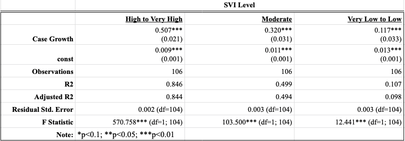
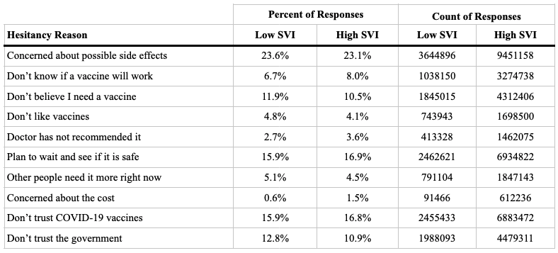
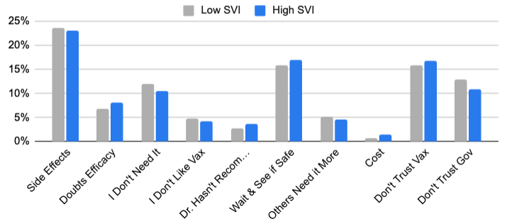

```{r setup, include=FALSE}
knitr::opts_chunk$set(echo = TRUE)
knitr::opts_chunk$set(warning = FALSE)
```

## Executive Summary

Our team aims to answer whether the social vulnerability index (SVI) of where Americans live influenced their willingness to receive the COVID-19 vaccine, and if so whether vaccine hesitancy reasons differ among the three SVI buckets (low, medium, high). SVIs correspond to Census tracts, and measure how resilient communities are to health stressors such as disease or natural disaster, based on a combination of demographic and socioeconomic factors. We employ Census Bureau Pulse survey data from June 23rd to July 5th on unvaccinated individuals’ reasons for vaccine hesitancy, as well as state-level SVI by averaging per county SVI (weighted by county population) from the CDC. We first find that individuals in high SVI states are more willing to get vaccinated conditional on being unvaccinated, despite being less vaccinated overall. Second, we find high SVI states are more responsive than low SVI states to COVID-19 case increases in terms of subsequent vaccine uptake using comparative correlation. Third, in attempting to see if reasons for vaccine hesitancy across SVI groups influence the prior results, we find that vaccine hesitancy reasons do differ significantly across high and low SVI states using Chi-Squared test analysis. Lastly, in order to provide insight on the observed differences in vaccine hesitancy reasons at large, we focus on “Doctor Has Not Recommended It” (rationale explained in Method Description) and find significant differences in the proportion of high SVI and low SVI states that have chosen this hesitancy reason using two-proportion test analysis. 

## Introduction

In early 2020, the first cases of a novel coronavirus known as SARS-CoV-2 were detected in the U.S. By the end of 2020, the COVID-19 pandemic had claimed over 360,000 American lives <sup>[1](#endnote1)</sup>. In response, U.S. health authorities quickly gave emergency authorization for the rollout of multiple vaccines that dramatically reduced the risk of severe illness or death from COVID-19.

Scarce vaccine supply hindered vaccine administration early in the rollout, creating challenges for health authorities seeking to administer the vaccine to society’s most vulnerable. However, even after supply constraints eased in July 2021, Centers for Disease Control (CDC) statistics showed that the average vaccination rate in counties with a high Social Vulnerability Index (SVI) lagged low-SVI counties by 3 percentage points <sup>[2](#endnote2)</sup>. Some researchers attributed these continuing challenges to “vaccine hesitancy,” or the unwillingness of certain individuals to receive the vaccine even if it was available <sup>[3](#endnote3)</sup>.

In this context, we chose to examine whether unvaccinated Americans’ willingness to receive the COVID-19 vaccine was affected by the SVI of the place where they resided. Whether or not social vulnerability was a relevant factor would have implications for policy initiatives that aimed to increase vaccination rates. Using datasets published by the CDC, Census Bureau, and The New York Times, we performed several statistical analyses to explore the relationship between these variables in July 2021, after vaccine supply issues had largely been resolved.

## Data Description

Our main variables of interest are Social Vulnerability Index (SVI), willingness to get vaccinated, rate changes in cases and vaccinations, and vaccine hesitancy reasons. Each variable is described below with details about their sources, how they are calculated, and where they are used in our analyses:

***SVI Level:*** Social Vulnerability Index, a metric calculated by the CDC and ATSDR (Agency for Toxic Substances and Disease Registry), indicates a community’s likelihood of needing support before, during, and after a public health emergency <sup>[4](#endnote4)</sup>. SVI has been used extensively by governments, health agencies, and academics during the pandemic to identify areas with the greatest risk of experiencing severe outbreaks and health outcomes <sup>[5](#endnote5)</sup>. In our analyses, we calculate state-level SVI by averaging the CDC’s county-level SVI and weighting by county population. We then bucket SVI into Low, Moderate, and High based on the CDC’s thresholds of 0.4 and 0.6 demarcating the boundaries of the middle category. All stages of our analysis use SVI as the independent variable given its substantive importance in mitigating the worst effects of COVID.

***Willingness to get vaccinated:*** The CDC conducts a bi-weekly “Pulse” survey, in which they ask respondents about their vaccination status and their willingness to get vaccinated. We aggregate state-level frequency counts of willingness buckets up to SVI level, and measure vaccination intent by SVI for Stage 1. We use the June 23rd - June 5th Pulse survey for our analysis because 1) virtually all remaining unvaccinated people by this point can safely be considered ‘hesitant’ given that they have had ample time to receive the vaccine after eligibility and supply constraints were cleared, and 2) this time window gives us the last snapshot of hesitancy before the Fourth Wave of July - October 2021, which is the time period we analyzed in all stages.

***Change in case and vaccination rates:*** Using daily state-level case data compiled by the New York Times and vaccination data from the CDC, we calculate rolling 7-day averages of the percent change in cumulative cases and the percent reduction in the remaining unvaccinated population over time. These variables allow us to measure how the unvaccinated population responds to case growth across SVI levels in Stage 1.

***Hesitancy reasons:*** In addition to vaccine willingness, the CDC’s Pulse survey also asks unvaccinated respondents why they have not been vaccinated. They are able to select all applicable reasons from a list of 10. We use this data in Stages 3 and 4 to examine whether hesitancy reasons differ by SVI. As with Stage 1, we use the June 23rd - June 5th Pulse survey.

***Table 1:*** Variables, definitions, and data sources 

+----------------------+---------------+--------------------------------+--------+
| Variable             | Unit          | Definition                     | Source |
+======================+===============+================================+========+
| Social Vulnerability | Category:     | Number between 0 and 1         | CDC    |
| Index (SVI) Level    | Low & High    | indicating a county’s          |        |
|                      |               | likelihood of needing support  |        |
|                      |               | before, during and after a     |        |
|                      |               | public health emergency        |        |
|                      |               | (calculated from 15 census     |        |
|                      |               | metrics, with 1 indicating the |        |
|                      |               | highest likelihood). Low SVI <=|        |
|                      |               | 0.4, High SVI >                |        |
|                      |               | 0.6 <sup>[6](#endnote6)</sup>  |        | 
+----------------------+---------------+--------------------------------+--------+
| Change in            | Percent       | % of remaining unvaccinated    | CDC    |  
| vaccination rate     |               | people receiving jab in past 7d|        |
+----------------------+---------------+--------------------------------+--------+
| Change in case rate  | Percent       | 7-day rolling average of new   | The New|
|                      |               | cases                          | York   |
|                      |               |                                | Times  |
|                      |               |                                |        |
+----------------------+---------------+--------------------------------+--------+
| Willingness to get   | Percent       | Self-reported vaccination      | Census |
| Vaccinated           |               | intent from unvaccinated Census| Bureau |
|                      |               | Bureau Pulse Survey respondents|        |
|                      |               | respondents                    |        |  
+----------------------+---------------+--------------------------------+--------+
| Hesitancy reasons    | Count by      | Self-reported reasons for not  | Census |
|                      | Category      | receiving the COVID-19 vaccine | Bureau |
|                      |               | among Pulse Survey respondents |        |
|                      |               | who will either probably,      |        |
|                      |               | probably not, are unsure, or   |        |
|                      |               | will definitely not get a      |        |
|                      |               | vaccine, or who don't plan on  |        |
|                      |               | receiving all doses            |        |
+----------------------+---------------+--------------------------------+--------+

## Description of Statistical Methods

We decided to focus our data and analysis on the timeframe from July 12 - October 28th for two primary reasons. The first is that this period occurs before children under the age of 16 became eligible for the vaccine, since vaccination rates began to increase more rapidly once that eligibility change went into effect. The second is that this time frame corresponds with the emergence of the fourth wave of the Delta variant, which will have greater policy implications as we potentially approach a fifth wave of the Omnicron variant. Within this timeframe, we then conducted four stages of analysis. 

***First stage.*** We perform a chi-squared test between the high and low SVI levels to evaluate whether Americans’ willingness to get vaccinated differed based on social vulnerability. Similar to the first stage, we used the state-level aggregations to categorize the data into high and low SVI categories.

***Second stage.*** We analyze how the relationship between COVID-19 case growth and vaccine uptake differs for each SVI bucket in order to determine whether responsiveness to caseload was correlated to social vulnerability. We use the county-level SVI data from the CDC and then calculate the weighted average by population to determine each state’s SVI level. We then calculate the correlation between case growth and vaccine uptake for each SVI bucket and graph the observations and regression lines on a scatter plot. 

***Third stage.*** We perform another chi-squared test between high and low SVI levels and vaccine hesitancy reasons to investigate whether Americans’ reasons for not getting vaccinated differed based on their social vulnerability. We include this analysis to further investigate the results from the earlier two stages and evaluate whether hesitancy reasons were related to the differences in Americans’ willingness to get vaccinated. 

**Fourth stage.** We hone in on one particular hesitancy reason that we hypothesize has the most explanatory power in uncovering why we see aggregate differences across all hesitancy reasons for high versus low SVI states. We choose “Doctor Has Not Recommended It” for two main reasons: unlike other hesitancy reasons that have to do with personal taste, trust, or concern, this one is less related to who someone is, and more related to the availability or quality of doctor relationships. We also hypothesize that high SVI states, which are those most vulnerable to health shocks, are likely to have more individuals without a doctor or quality doctor: this comes from our first stage evidence that high SVI states are more willing to be vaccinated despite being less vaccinated on average.

We run a two-proportion test comparing the percentage of high-SVI respondents selecting the “Doctor Has Not Recommended It” reason  $P(HighSVI)$ to the percentage of low-SVI respondents selecting the “Doctor Has Not Recommended it” reason $P(LowSVI)$. Our null hypothesis is $P(HighSVI)$ = $P(LowSVI)$ and our alternative hypothesis is $P(HighSVI)$ > $P(LowSVI)$.

## Results

We find several insights from the above four stages of analysis:

***1. Individuals in high-SVI counties are on average more willing to be vaccinated.*** The bar chart displays the distribution of survey respondents’ attitudes toward vaccination, separated by those living in low- and high-SVI states. Visual inspection shows that high-SVI respondents tend to skew toward the right (more willing to be vaccinated), and statistical tests confirm that the difference between the two distributions is statistically significant.

Figure 1: CDC Pulse Survey Vaccine Willingness Responses (June 23, 2021 - July 5, 2021)

 \newline


***2. The vaccination rate of high-SVI states is more responsive to rising cases compared to low-SVI states.*** Figure 1 illustrates how the relationship between change in vaccination rate and change in COVID-19 case rate differs for each SVI level. High-SVI states have the greatest slope of 0.507, meaning that these states have the greatest responsiveness to increasing case rates. Meanwhile, states with lower social vulnerability were less responsive to increasing case rates on average in the 108-day timeframe between July 12, 2021 and October 28, 2021.

Figure 2: Change in vaccination rate and change in COVID-19 case rate (July 12th - Oct 28th 2021)

\newline


***3. Unvaccinated individuals in high-SVI states had meaningfully different reasons for not receiving the vaccine when compared with their counterparts in low-SVI states.*** Our chi-squared test between low- and high-SVI states showed that the difference in reasons people in low- and high-SVI states were hesitant to receive the COVID-19 vaccine was statistically significant. Two key results in particular were that respondents from high-SVI states were less likely to trust the government than respondents from low-SVI states (10.2% of responses vs. 11.2%) and were more likely to trust the COVID-19 vaccine (15.7% of responses vs. 14.5%). 


***4. Vaccine-hesitant individuals in high-SVI counties are more likely to cite a lack of a doctor’s recommendation as a reason when compared with their counterparts in low-SVI counties.*** Our two-proportions test supports that respondents in high-SVI states are more likely to be hesitant towards receiving the vaccine because a “Doctor Has Not Recommended It”. With a proportion of 7.5% of high-SVI state respondents selecting this option, compared to 6.7% of low-SVI state respondents, we find this difference is very statistically significant, rejecting the null hypothesis that the proportions are equal. While the raw percentage difference is small, this still has meaningful implications as it relates to willingness to receive the vaccine, as it implies that healthcare availability or quality issues as a factor in why high-SVI states may be more willing to be vaccinated at face value, but are less vaccinated. 


## Limitations

There were a few limitations in this research:

* Although SVI is determined at the county level, we aggregate SVI to the state level to match the granularity of the data on vaccine hesitancy reasons from the Census Bureau’s Pulse survey. State SVI is calculated as the average of that state’s individual county SVIs, weighted by county population. This approach does not address the variation of social vulnerability within each state and thus neglects the possibility that respondents from a low-SVI state may still be very socially vulnerable.
* The Census Bureau’s Pulse survey data includes responses from individuals who selected that they “probably will receive” the vaccine, meaning some respondents evaluated for vaccine hesitancy may be more amenable to receiving the vaccine.
* Because the chi-squared test used in the third stage of our analysis uses 12 categories (corresponding to the different vaccine hesitancy reasons), the test may return statistically significant results for relatively small differences in the data being compared. This is because it is more likely for categories in a chi-squared test to be unequally distributed as the number of categories increases.


## Conclusion

As new COVID-19 variants and outbreaks continue to emerge, vaccination remains the best tool at policymakers’ disposal. The low vaccination rate of high-SVI areas continues to be a concern. However, we find that individuals living in these high-SVI areas had both greater willingness to be vaccinated and greater responsiveness to rising cases in the summer and fall of 2021. Both of these results challenge the assumption that low vaccination rates in vulnerable areas can be solely attributed to vaccine hesitancy.

At the same time, we also demonstrate that vaccine-hesitant individuals in high-SVI communities have unique concerns that are distinct from their counterparts in low-SVI communities. In particular, high-SVI communities are more likely to trust the COVID-19 vaccine and less likely to trust the government. These differences suggest that vaccination campaigns could be more effective if they are tailored to build public trust depending on the vaccine hesitancy reason and social vulnerability of the target community. 

The tension between low vaccination rates and high willingness to be vaccinated in high-SVI areas indicates two potential areas for further exploration. First, additional research is needed to determine whether access issues remain that prevent willing individuals from receiving the vaccine (for example, fear of side effects that would prevent an individual from going to work). Second, while we studied one reason for vaccine hesitancy (lack of doctor’s recommendation), further study is necessary to understand the specific concerns that still sustain vaccine hesitancy in high-SVI communities. Together, these further studies would help policymakers effectively extend vaccination efforts into vulnerable communities where vaccines are most needed.

\newpage

## Technical Appendix

### First Stage Analysis:

To compare willingness to get vaccinated across SVI levels, we compared the distribution of self-reported vaccination intent among unvaccinated Pulse survey respondents (Table 2). A Pearson’s Chi-squared test reveals a statistically significant difference in willingness to get vaccinated at the 0.01 significance level, giving us strong evidence to reject the null that willingness to get vaccinated is the same across SVI levels (Figure 3). Comparing the proportion of respondents in each willingness bucket reveals more soft willingness and uncertainty in High SVI states, and more hard hesitancy in Low SVI states (Table 3). [R Code](https://github.com/mraottth/API-201Z/blob/main/R/health5_hesitancy_level.R)

***Table 2:*** Willingness to get vaccinated - Census Bureau Pulse Survey (June 23 - July 5 2021)

\newline

***Figure 3:*** Willingness to get vaccinated - Census Bureau Pulse Survey (June 23 - July 5 2021)

\newline

**Table 3:** Pearson's Chi-squared test of willingness to get vaccinated

\newline

### Second Stage Analysis:

To examine how responsive the unvaccinated population is to rate changes in in-state case growth, we calculated a per-day, per-SVI-Level coordinate pair of case growth* and vaccination response** before running a linear least-squares regression on the data (Figure 4). We find that High SVI states are the most responsive to case growth rate, as indicated by its high slope and r value (Table 4). This finding is consistent with our results from Stage 1, which shows that hesitancy is less firmly held in High SVI states. [Python Code](https://github.com/mraottth/API-201Z/blob/main/Python/stage2.py)

*The % growth in cumulative cases in the past 7 days, per-day per-SVI level)

**The % of remaining unvaccinated people receiving a jab in the past 7 days, per-day per-SVI level)

***Figure 4:*** How the unvaccinated respond to increasing caseload

\newline

***Table 4:*** Regression table - dependent variable is vaccination response to case growth

\newline
 
### Third Stage Analysis:

To evaluate vaccine hesitancy reasons across SVI levels, we compared the distribution of self-reported hesitancy reasons among unvaccinated Pulse survey respondents (Table 5). A Pearson’s Chi-squared test reveals a statistically significant difference in the distribution of hesitancy reasons at the 0.01 significance level, giving us strong evidence to reject the null that the reasons for not receiving the COVID-19 vaccine are the same across SVI levels (Table 6). [R Code](https://github.com/mraottth/API-201Z/blob/main/R/health6_hes_reasons.R)

***Table 5:*** Reasons for vaccine hesitancy - Census Bureau Pulse Survey (June 23 - July 5 2021)

\newline

***Figure 5:*** Reasons for vaccine hesitancy - Census Bureau Pulse Survey (June 23 - July 5 2021)

\newline

***Table 6:*** Pearson's Chi-squared test of hesitancy reasons

\newline

### Fourth Stage Analysis:

With a raw number of respondents selecting “Doctor Has Not Recommended It” of 1,363,904 out of 18,125,017 total respondents from high-SVI states, and 483,370 respondents out of 7,178,088 total respondents from low-SVI states, we run a two-proportions hypothesis test taking Ho: $P(HighSVI)$ = $P(LowSVI)$  and HA: $P(HighSVI)$ > $P(LowSVI)$. With a p-value well below the critical value of 0.01, we strongly reject the null hypothesis that the proportion of respondents selecting this hesitancy reason from high-SVI and low-SVI states are equal (Table 7). 

**Table 7:** 2-Sample test for equality of proportions  
\newline

\newpage

***Endnotes:*** \newline

<a name="endnote1">1</a>: https://covid.cdc.gov/covid-data-tracker/#trends_totaldeaths

<a name="endnote2">2</a>: https://healthpolicy.usc.edu/research/covid-19-vaccine-county-rate-analysis/

<a name="endnote3">3</a>: https://www.ncbi.nlm.nih.gov/pmc/articles/PMC8030992/

<a name="endnote4">4</a>: https://www.atsdr.cdc.gov/placeandhealth/svi/index.html

<a name="endnote5">5</a>: https://www.atsdr.cdc.gov/placeandhealth/project_snapshots/svitool_covid.html

<a name="endnote6">6</a>: https://www.atsdr.cdc.gov/placeandhealth/svi/index.html
